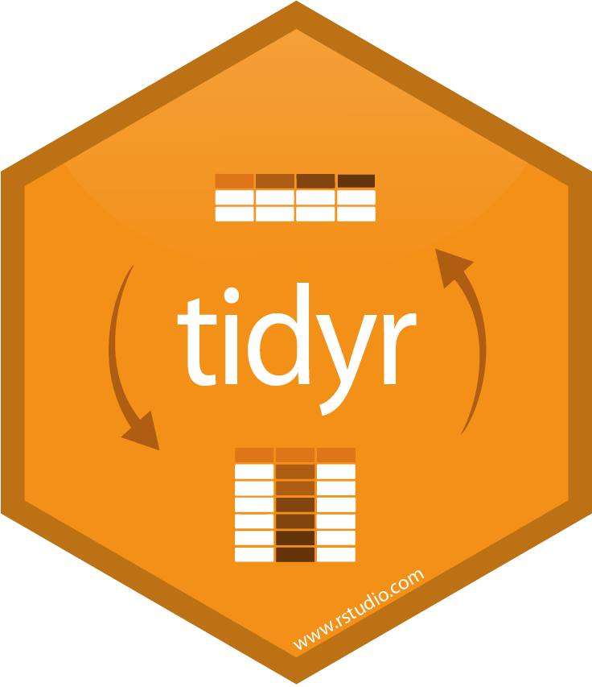

```{r setup, include=FALSE}
options(htmltools.dir.version = FALSE)
knitr::opts_chunk$set(message = FALSE, 
                      warning = FALSE, 
                      echo = FALSE, 
                      fig.align = 'center')
library(RefManageR)
library(tidyverse)

bibs <- ReadBib("bibliography.bib", check = FALSE)
```


# Partes

  1. Introdução sobre R e RStudio.
    - Universo `tidyverse`.
  2. Tibbles x Data Frames.
    - O que é Dados Organizados?
    - Operador *pipe* `%>%`.
    - Breve introdução ao Tidyr.
      - gather(); spread(); separate(); unite().
  3. Manipulando Data Frames com `dplyr`.
    - select(); rename(); mutate().

---
class: inverse, middle, center


# R & RStudio

---
# O ambiente R

R é uma linguagem de programação estatística que vem passando por diversas evoluções e se tornando cada vez mais uma linguagem de amplos objetivos.
Excelente para manipulação de dados, cálculo e exibição gráfica. Segue alguns motivos para aprender o R:

--

  - É completamente gratuito e de livre distribuição;

--

  - Curva de aprendizado bastante amigável, sendo muito fácil de se aprender;

--

  - Enorme quantidade de tutoriais e ajuda disponíveis gratuitamente na internet;

--

  - É excelente para criar rotinas e sistematizar tarefas repetitivas;

--

  - Amplamente utilizado pela comunidade acadêmica e pelo mercado;

--

  - Quantidade enorme de pacotes, para diversos tipos de necessidades;

--

  - Ótima ferramenta para criar relatórios e gráficos.

---

# R

Após instalado, o R tem uma interface assim, com apenas o console para digitar comandos.

```{r figure3, echo=FALSE, fig.align='center', out.width="80%"}
knitr::include_graphics("imagens/r-project.png")
```

Experimente um comando: 2+2, cujo output é 4.

---

# RStudio

E a interface do RStudio é dividida, inicialmente, em 3 partes.

```{r figure4, echo=FALSE, fig.align='center', out.width="80%"}
knitr::include_graphics("imagens/rstudio-console.png")
```

---
# RStudio

A forma mais eficiente e prática de usar o R ou o RStudio é através de um script. No RStudio, vá em *File → New File → R Script*. A interface agora fica dividida em 4 partes.

```{r figure5, echo=FALSE, fig.align='center', out.width="70%"}
knitr::include_graphics("imagens/rstudio-editor.png")
```

---
# Classes de Objetos no R

R possui 5 classes básicas de objetos, também chamados de objetos "atômicas":

  - character;

  - numeric (real numbers);

  - integer;

  - complex;

  - logical (True/False).

O tipo mais básico de objeto R é um vetor. Um vetor só pode conter elementos de uma mesma classe. Mas há uma exceção, que é uma lista. Uma lista é representada como um vetor, mas pode conter objetos de diferentes classes. 

---

# Atributos 

Os objetos R podem ter atributos, como metadados para o objeto. Esses metadados podem ser muito úteis, pois ajudam a descrever o objeto. Por exemplo, nomes de colunas em um quadro de dados ajudam a nos dizer quais dados estão contidos em cada uma das colunas. Alguns exemplos de atributos de objeto R são:

  - nomes, dimnames;

  - dimensões (por exemplo, matrizes, matrizes);

  - classe (por exemplo, inteiro, numérico);

  - comprimento;

  - outros atributos/metadados definidos pelo usuário.

Os atributos de um objeto (se houver) podem ser acessados usando a função `attributes()`. Nem todos os objetos R contêm atributos; nesse caso, a `attributes()` retorna NULL.

---

# Pacote `swirl`

O `swirl` é um pacote do R construído para transformar o console em uma ferramenta interativa para aprender R. `swirl` ensina programação de R e ciência de dados interativamente, no seu próprio ritmo e diretamente no console do R. Para entender melhor o projeto, veja http://swirlstats.com/ e http://swirlstats.com/students. Nestes endereços são dados os detalhes sobre como usar o `swirl`. Uma vez intalado e carregado o pacote, você é levado a efetuar tarefas.

O `swirl` dá acesso às tarefas de cursos de R que estão disponíveis também no Coursera, como o R Programming: The basics of programming in R, em https://pt.coursera.org/learn/r-programming. Além deste, estão disponíveis no `swirl`: Regression Models: The basics of regression modeling in R, Statistical Inference: The basics of statistical inference in R, e Exploratory Data Analysis: The basics of exploring data in R.

---

# Tibbles x Data frames

Mas afinal, como dois quadros de dados aparecem totalmente diferentes no console?

O que é um tibble? Tibbles são similares aos data frames, porém diferentes em dois aspectos: **impressão** e **indexação**.

Sempre que indexarmos um tibble usando `[`, o resultado será outro tibble. Usando `[[` o resultados será um vetor.

Na impressão no console, os *tibbles* apresentam apenas as dez primeiras linhas e todas as colunas que cabem na tela, tornando mais fácil o trabalho com grandes volumes de dados.

---

class: inverse, middle, center


# `tidyverse`

```{r, echo = FALSE, out.width="25%", fig.align='center'}
knitr::include_graphics("imagens/tidyverse.png")
```

---

# Universo *tidyverse*

> O tidyverse é uma coleção de pacotes R projetados para ciência de dados. Todos os pacotes compartilham uma filosofia de design, gramática e estruturas de dados subjacentes.

```{r, echo = FALSE, out.width="85%", fig.align='center'}
knitr::include_graphics("imagens/tidyverse_1.png")
```

---

class: inverse, middle, center

# ` %>% `

```{r figure9, echo=FALSE, fig.align='center', out.width='25%'}
knitr::include_graphics("imagens/magritt.png")
```

---

# Operador *pipe* `%>%`

O pacote `magrittr` tem dois objetivos: diminuir o tempo de desenvolvimento e melhorar a legibilidade e a manutenção do código. Para começar a utilizar o *pipe*, instale e carregue o pacote `magrittr`.

```{r eval=FALSE, echo=TRUE}
install.packages("magrittr")
library(magrittr)
```

O operador do **pipeline** `%>%` é muito útil para reunir várias funções em uma sequência de operações.

Tubulação básica:

  - x `%>%` *f* é equivalente a *f(x)*;
  - x `%>%` *f(y)* é equivalente a *f(x, y)*;
  - x `%>%` *f* `%>%` *g* `%>%` *h* é equivalente a *h(g(f(x)))*.

---

# ` %>% `

Observe abaixo que toda vez que desejamos aplicar mais de uma função, a sequência é ocultada em uma sequência de chamadas de funções aninhadas difíceis de ler, ou seja:

> third(second(first(x)))

Esse aninhamento não é uma maneira natural de pensar em uma sequência de operações. O `%>%` permite que você encadeie operações da esquerda para a direita, ou seja:

> first(x) %>% second() %>% third()

Por exemplo:

---

# ` %>% `

````{r echo=TRUE}
x <- c(0.109, 0.359, 0.63, 0.996, 0.515, 0.142, 0.017, 0.829, 0.907)

round(exp(diff(log(x))), 1)
```

Com ajuda do *pipe*:

```{r echo=TRUE}
x %>% 
  log() %>% 
  diff() %>% 
  exp() %>% 
  round(1)
```

---

# ` %>% `

Em resumo, aqui estão quatro razões pelas quais você deve usar tubos ou pipe no R:

  - Estruturara a sequência de suas operações de dados da esquerda para a direita, ao contrário de dentro para fora;

  - evita chamadas de função aninhadas;

  - minimiza a necessidade de variáveis locais e definições de funções;

  - facilita a adição de etapas em qualquer lugar da sequência de operações.

---

# ` %T>% `

Mesmo sendo `%>%` o operador de tubulação (principal) do pacote magrittr, existem alguns outros operadores que fazem parte do mesmo pacote:

Ao trabalhar com tubos mais complexos, às vezes é útil chamar uma função por seus efeitos colaterais. Talvez você queira imprimir o objeto atual, plotá-lo ou salvá-lo em disco. Muitas vezes, essas funções não retornam nada, efetivamente encerrando o pipe.

Para contornar esse problema, usar-se o tubo *"tee"* `%T>%` funciona como `%>%` exceto que retorna o lado esquerdo em vez do lado direito. É chamado de *“tee”* porque é como um tubo em forma de T literal.

---

```{r echo = TRUE}
rnorm(100) %>%
  matrix(ncol = 2) %>%
  plot() %>%
  str()
```

---

```{r echo = TRUE}
rnorm(100) %>%
  matrix(ncol = 2) %T>%
  plot() %>%
  str()
```

---

# Dados organizados

Costuma-se dizer que 80% da análise de dados é gasta no processo de limpeza e preparação dos dados (Dasu e Johnson 2003).

Por que garantir que seus dados estejam organizados? Existem duas vantagens principais:

  - Há uma vantagem geral em escolher uma maneira consistente de armazenar dados. Se você possui uma estrutura de dados consistente, é mais fácil aprender as ferramentas que funcionam com ela porque elas têm uma uniformidade subjacente.

  - Há uma vantagem específica em colocar variáveis em colunas porque permite que a natureza vetorizada de R seja eficiente. A maioria das funções R trabalha com vetores de valores. Isso faz com que a transformação de dados organizados pareça particularmente natural.

O `dplyr`, o `ggplot2` e todos os outros pacotes no tidyverse foram projetados para trabalhar com dados organizados. 

---

class: inverse, middle, center

# `tidyr`

```{r figure0, echo=FALSE, fig.align='center', out.width="25%"}

```

---

### `tidyr`

O objetivo do tidyr é ajudá-lo a criar dados organizados. 

  - 1.Cada variável no conjunto de dados é colocada em sua própria coluna;
  
  - 2.Cada observação é colocada em sua própria linha;
  
  - 3.Cada valor é colocado em sua própria célula.

Os dados que satisfazem essas regras são conhecidos como dados organizados

```{r figure7, echo=FALSE, fig.align='center', out.width="95%"}
knitr::include_graphics("imagens/tidy-1.png")
```

---

### `tidyr`

Vamos instalar o pacote `EDAWR` e carregá-lo:
```{r eval=FALSE, echo=TRUE}
devtools::install_github("rstudio/EDAWR")
library(EDAWR)
```

Quais desses quadros de dados são mais similares a dados organizados?
```{r}
storms
```
--

---

# `tidyr`

O `tidyr` possui duas funções principais:

`gather`: Transforma um `tibble` *wide* em *long*, ou seja, transforma os dados no formato *tidy*.

`spread`: Transforma um `tibble` *long* em *wide*, ou seja, transforma dados que estão no formato *tidy* em formato não *tidy*.

---

class: inverse, middle, center

# `dplyr`

```{r figure6, echo=FALSE, fig.align='center', out.width='25%'}
knitr::include_graphics("imagens/dplyr.png")
```

---

# O Pacote `dplyr`

O pacote `dplyr` foi desenvolvido por Hadley Wickham, cientista chefe do RStudio. É uma versão otimizada do pacote `plyr`. O pacote `dplyr` não fornece nenhuma funcionalidade "nova" ao R, pois já é feito com base no R, mas simplifica **bastante** a funcionalidade no R.

Uma contribuição importante do `dplyr` é que ele fornece uma "gramática" (em particular, verbos) para manipulação 

---
# Gramática do `dplyr`

Alguns dos principais "verbos" básicos de tabela única fornecidos pelo `dplyr` são:

  - `select`: retorna um subconjunto das colunas de um data.frames, usando uma notação flexível;
  
  - `pull()`: retire uma única variável;
  
  - `filter`: extrair um subconjunto de linhas(observações) de um data.frames com base em condições lógicas;
  
  - `arrange`: reordenar linhas de um data.frames;
  
  - `rename`: renomear variáveis em um data.frames;
  
  - `mutate`: adiciona novas variáveis/colunas ou transforme variáveis existentes;
  
  - `summarise/summarize`: gera estatísticas resumidas de diferentes variáveis no data.frames, possivelmente dentro dos estratos.
  
---

## Propriedades das funções do `dplyr`

As funções têm algumas características comuns:

  - 1.O primeiro argumento é um data.frames;
  
  - 2.Os argumentos subsequentes descrevem o que fazer com o data.frames especificado no primeiro argumento;
  
  - 3.O resultado de retorno de uma função é um novo data.frames;
  
  - 4.Os data.frames devem devidamente formatados e anotados para que tudo isso seja útil. Em particular, os dados devem estar *organizados*.

---

## Instalando o Pacote `dplyr`

O pacote pode ser instalado a partir do CRAN ou do GitHub usando o pacote `devtools` com a função `install_github()`. O repositório GitHub normalmente contém as versões mais atualizadas dos pacotes.

Para instalar a partir do CRAN, bastar executar:

````{r script4.1, eval=FALSE}
install.packages("dplyr")
```

Para instalar a partir do GitHub, execute:

```{r script4.2, eval=FALSE}
library(devtools) #carregar o pacote 'devtools' antes.
devtools::install_github("hadley/dplyr")
```

Após a instalação do pacote, carregá-lo com a função `library()`:

```{r script4.3}
library(dplyr)
```

Ao carregar o pacote você pode receber alguns avisos, porque há funções no `dplyr`que têm o mesmo nome que as funções em outros pacotes. Por enquanto pode ignorar os avisos.

---

Para melhor apresentar as funcionalidades da função, usaremos um conjunto de dados diários sobre poluição do ar e taxa de mortalidade da [cidade de Chicago](http://www.biostat.jhsph.edu/~rpeng/leanpub/rprog/chicago_data.zip), nos EUA. Este banco de dados encontra no seguinte endereço:  <http://www.biostat.jhsph.edu/~rpeng/leanpub/rprog/chicago_data.zip> e está em um arquivo zipado.

Você pode carregar os dados no R usando a função `readRDS()`:

```{r script4.4, echo=TRUE}
chicago <- readRDS("data/chicago.rds")
```

---

Descrição do banco: tem 8 colunas e 6940 linhas. Cada linha refere-se a um dia. As colunas são:

  - city: cidade, neste campo tem apenas "chic" referenciando a cidade de Chicago.

  - tmpd: temperatura em Fahrenheit.
  
  - dptp: temperatura do ponto de orvalho.
    
  - date: tempo em dias.
  
  - pm25tmean2: partículas médias < 2,5mg por m cúbico (mais perigoso).
    
  - pm10tmean2:  partículas médias em 2,5^-10 por m cúbico.
  
  - o3tmean2: Ozônio em partes por bilhão.
  
  - no2tmean2: Medição mediana de dióxido de sulfato.
  
Umas das formas de ter informações do seu banco de dados é utilizar as seguintes funções `dim()` e `str()`. A primeira especifica a dimensão do seu banco e a segunda a estrutura do seu banco de dados.

---

# `select()`

Muitas vezes teremos um data.frames contendo um grande número de dados. Com isso, a função `select()` permite obter as poucas colunas que você pode precisar.

Suponhamos que desejássemos pegar as 3 primeiras colunas. Há algumas maneiras de fazer isto. Poderíamos, por exemplo, usar o índices númericos. Mas também podemos usar os nomes diretamente. 

```{r script4.6, echo = TRUE}
names(chicago[1:3]) 
subset1 <- select(chicago, city:dptp)
head(subset1)
```

---

# `select()`

Normalmente `:` não pode ser usado com nomes ou sequências de caracteres, mas dentro da função `select()` pode usá-lo para especificar um intervalo de nomes de variáveis.

Pode **omitir** variáveis usando a função `select()` usando o sinal negativo.

```{r script4.7, echo = TRUE}
subset2 <- select(chicago, -(city:dptp))
head(subset2)
```

---

# `select()`

o que indica que estamos incluindo todas as variáveis, exceto as variáveis `city` até `dptp`.

O código equivalente ao anterior sem o uso do pacote seria:

```{r echo = TRUE}
i <- match("city", names(chicago))
j <- match("dptp", names(chicago))
head(chicago[, -(i:j)])
```

---

A função de correspondência `mathc()` retorna um vetor das posições das (primeiras) correspondências de seu primeiro argumento no segundo. De acordo com a [Documentação R](https://stat.ethz.ch/R-manual/R-devel/library/base/html/match.html), a função é equivalente ao operador `%in%` que indica se uma correspondência foi localizada para o vetor1 no vetor2. O valor do resultado será VERDADEIRO ou FALSO, mas nunca NA. Portanto, o operador `%in%` pode ser útil em condições `if`. Por exemplos:

```{r echo=TRUE}
#função math().
v1 <- c("a1","b2","c1","d2")
v2 <- c("g1","x2","d2","e2","f1","a1","c2","b2","a2")
x <- match(v1,v2)
x

#com o operador %in%.
v1 <- c("a1","b2","c1","d2")
v2 <- c("g1","x2","d2","e2","f1","a1","c2","b2","a2")
v1 %in% v2
```

---

## `starts_with()`

A função `select()` permite uma sintaxe especial que especifica nomes de variáveis com base em padrões. Por exemplo, há várias funções auxiliares que você pode usar:

`starts_with("abc")`: corresponde aos nomes que começam com "abc";

```{r echo = TRUE}
#Queremos manter todas as variáveis que começam com um "d":
subset3 <- select(chicago, starts_with("d"))
head(subset3)
```

---

## `ends_with()`

`ends_with("xyz")`: corresponde aos nomes que terminam com "xyz";

```{r echo=TRUE}
subset4 <- select(chicago, ends_with("2"))
head(subset4)
```

---

## `contains()`

`contains("ijk")`: corresponde aos nomes que contêm "ijk";

```{r echo=TRUE}
subset5 <- select(chicago, contains("tmean"))
head(subset5)
```

---

## `matches("(.)\\1")`
  
`matches("(.)\\1")`: selecionar variáveis que correspondem a uma expressão regular. Esta corresponde a qualquer variável que contenha caracteres repetidos. Você aprenderá mais sobre expressões regulares no capítulo  [Strings](https://r4ds.had.co.nz/strings.html) do livro [R for data science](https://r4ds.had.co.nz/).

```{r}
subset6 <- select(chicago, matches(c(".m."), names(chicago)))
head(subset6)
```

---

## `num_range("x", 1:3)`
  
`num_range("x", 1:3)`: Corresponde x1, x2 e x3.

```{r echo=TRUE}
#Criando um objeto df que é um data frame
df <- as.data.frame(matrix(runif(100), nrow = 10)) 
df <- tbl_df(df[c(3, 4, 7, 1, 9, 8, 5, 2, 6, 10)])
select(df, V4:V6)
select(df, num_range("V", 4:6))
```

---

Você também pode usar expressões regulares mais gerais, se necessário. Veja a página de ajuda (?select) para mais detalhes.

`select()` pode ser usado para renomear variáveis, mas raramente é útil porque descarta todas as variáveis não mencionadas explicitamente. Em vez disso, use `rename()`, que é uma variante de `select()` que mantém todas as variáveis que não são mencionadas explicitamente.

Outra opção é usar `select()` em conjunto com o `everything()` auxiliar. Isso é útil se você tiver um punhado de variáveis que deseja mover para o início do quadro de dados.

```{r echo=TRUE}
subset7 <- select(chicago, o3tmean2, no2tmean2, everything())
head(subset7)
```

---

# `rename()`

Para renomear variáveis em uma data.frames em R não é tão prático. E a função `rename()` foi projetada para facilitar esse processo.

Os nomes das cinco primeiras variáveis do data frame chicago.

```{r echo=TRUE}
#Imprimir às 3 primeiras linhas da primeira a quinta coluna.
head(chicago[, 1:5], 3)
```

---

# `rename()`

A coluna `dptp` deve representar a temperatura do ponto de orvalho e a coluna `pm25tmean2` fornece os dados do PM2.5. No entanto, esses nomes são bastante obscuros ou estranhos e provavelmente serão renomeados para algo mais sensato.

```{r echo=TRUE}
chicago <- rename(chicago, Temp_Orv = dptp, pm25 = pm25tmean2)
head(chicago[, 1:5], 3)
```

A sintaxe dentro da `rename() ` função é ter o novo nome no lado esquerdo do `=` sinal e o nome antigo no lado direito.

---

# `mutate()`

Em certas situações é útil adicionar novas colunas/variáveis que são funções de colunas existentes no data frames, ou seja, criar novas variáveis derivadas de variáveis existentes. Esse é o trabalho de `mutate()`. Esta função adiciona novas colunas no final do seu conjunto de dados. `mutate()` fornece uma interface limpa para fazer isso. Lembre-se de que, quando você está no RStudio, a maneira mais fácil de ver todas as colunas é `View()`.

Por exemplo, com os dados de poluição do ar, subtraindo a média dos dados. Dessa forma, podemos verificar se o nível de poluição do ar de um determinado dia é maior ou menor que a média (em oposição a observar seu nível absoluto).

---

# `mutate()`

Aqui, criamos uma variável `pm25difmean` que subtrai a média da variável `pm25`.

```{r echo = TRUE}
chicago <- mutate(chicago, pm25difmean = pm25 - mean(pm25, na.rm = TRUE))
head(chicago)
```

---

# `mutate()`

Há também a função relacionada `transmute()`, que faz a mesma coisa que `mutate()`, mas elimina todas as variáveis não transformadas.

Aqui, desprezamos as variáveis PM10 e ozônio (O3).

```{r echo = TRUE}
head(transmute(chicago, 
               pm10difmean = pm10tmean2 - mean(pm10tmean2, na.rm = TRUE),
               O3difmean = o3tmean2 - mean(o3tmean2, na.rm = TRUE)))
```

Observe que existem apenas duas colunas no quadro de dados transformados.

---


Há inúmeras funções que pode ser feita, a propriedade é que a função deva ser vetorizada: ela deve pegar um vetor de valores como entrada, retornar um vetor com o mesmo número de valores que a saída. Não há como listar todas as funções possíveis que você possa usar, mas aqui está uma seleção de funções frequentemente úteis:

---
class: center, middle, inverse

# Obrigado!
# Continua...


 

<b>

[@Doug7Vinicius](https://github.com/Doug7Vinicius/introduction-dplyr)
